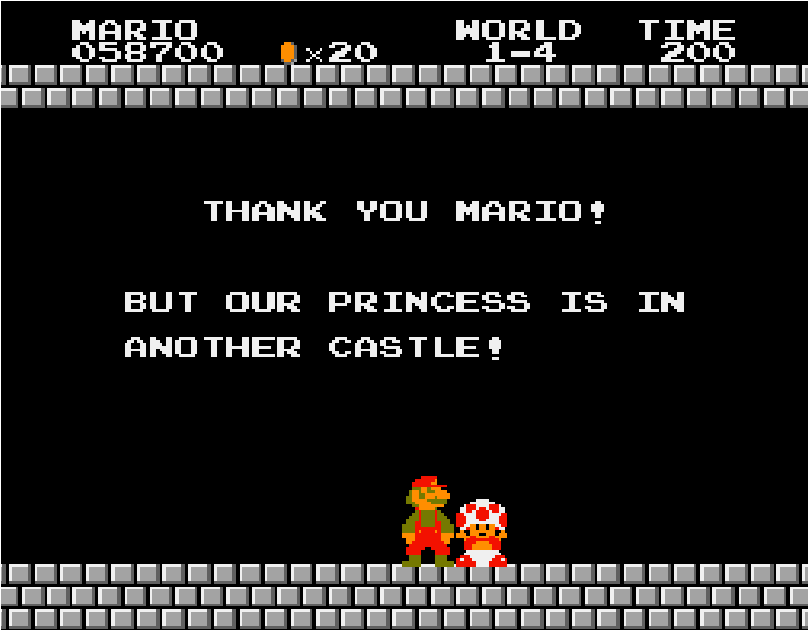
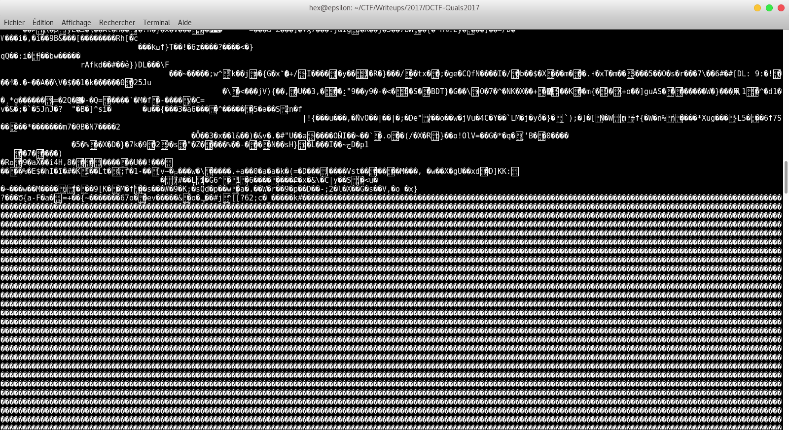

# A talkative Server  

En se rendant sur la page image.php, on constate que la page, après avoir affiché une image continue son chargement.


À l’aide de curl, on inspecte ce qu’il se passe au niveau des trames :
```
curl -H --url https://a-talkative-server.dctf-quals-17.def.camp/image.php
```


On constate alors que pas mal de données sont envoyées :


On redirige le flux en sortie dans un fichier temporaire, qui prend la forme d’une archive.

```
curl -H --url https://a-talkative-server.dctf-quals-17.def.camp/image.php > out
```

Après extraction on obtient un fichier data d’environ 11Go, on le parse avec strings.
```
strings out
```
Et au bout d’un certain temps...


Puis on enlève tout ce qui ne ressemble pas à de l’hexadécimal,
FLAG !
