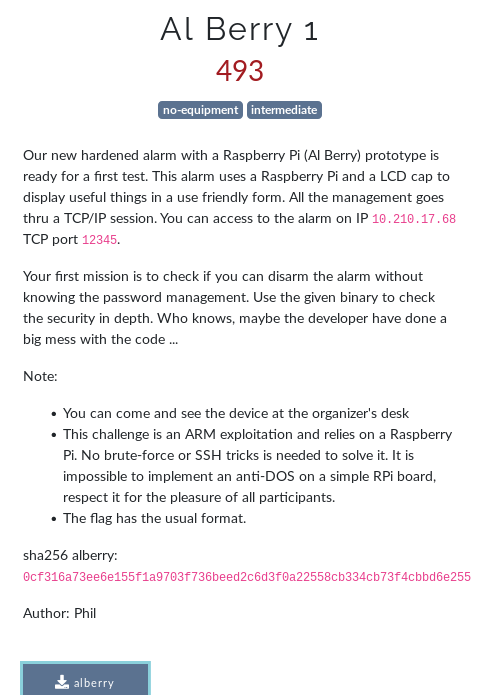
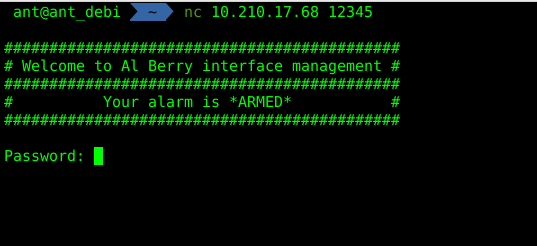
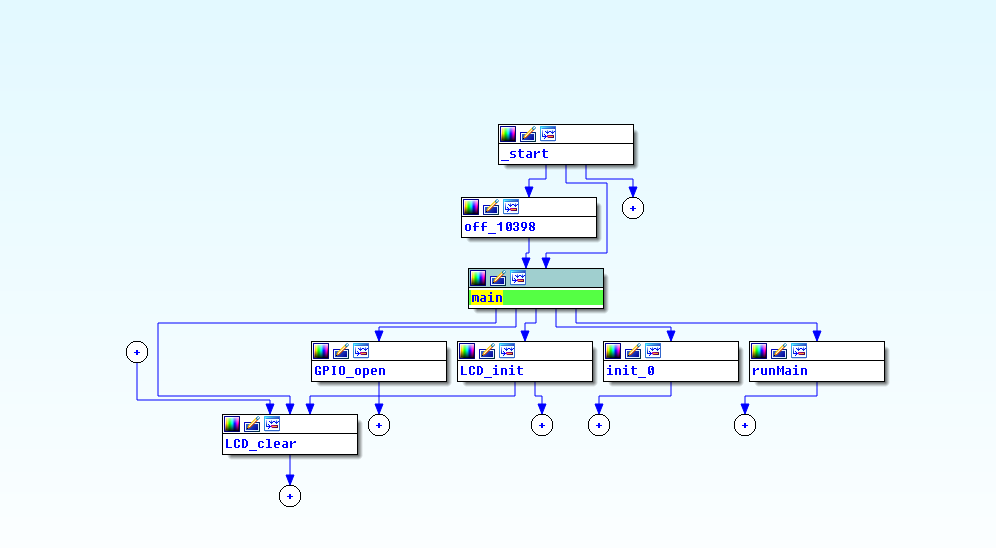
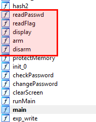
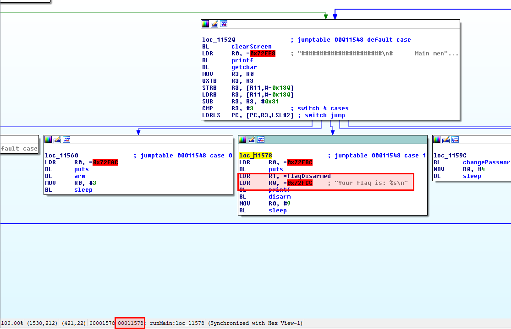

# Challenge Write-Up : al berry

URL du CTF : http://ph0wn.org/
Catégorie: Exploit

## Description du challenge



## Résolution du challenge

Dans un 1er temps, nous nous sommes connectés sur l'alarme Al Berry via le port 12345 via ```nc 10.210.17.68 12345```.


Nous avons un message nous demandant de saisir un mot de passe, celui-ci sert sûrement à désactiver l'alarme.



Dans la description du challenge, un binaire alberry nous est fourni.
A l'aide de ce binaire, nous allons essayer de vérifier s’il est possible de désactiver l'alarme sans connaître le mot de passe.


On peut voir que le binaire est un ELF32 bit et qu'il n'est pas "strippé" (les symboles sont présents). 
À l'aide de IDA, nous allons décompiler cet exécutable 32 bits.



Dans le code nous découvrons plusieurs fonctions intéressantes comme readFlag et readPasswd.



Mais aussi l'endroit où est affiché le flag.



Sachant que ce challenge est dans la catégorie exploit, nous devinons que la méthode d'obtention du flag sera sûrement via un buffer overflow.

Afin de confirmer notre idée, nous envoyons comme payload l'adresse mémoire où se trouve la lecture du flag ```0x00011578```.

Comme nous agissons ici en aveugle, nous avons décidé d'envoyer l'adresse de lecture du flag multipliée un certain nombre de fois afin d'éviter de connaitre le nombre exacte de caractère permettant l'écrasement de l'adresse de retour.


C'est gagné ! Le flag est ph0wn{Enjoy_the_Silence}
